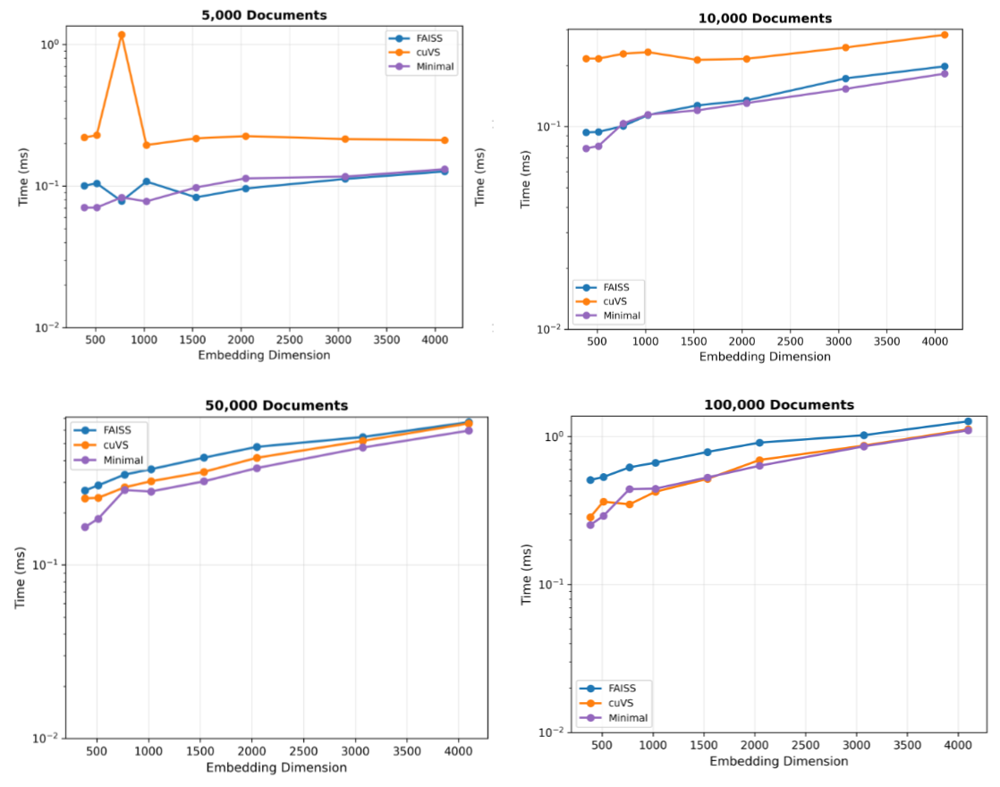

# Cuflat

Custom CUDA kernels optimized for small datasets and specific embedding dimensions to deliver faster performance than FAISS and competitive performance with cuVS for datasets under 100K documents.

## Performance

Cuflat is specifically optimized for embedding dimensions of **384, 512, 768, and 1024** - common dimensions used in modern embedding models. It uses cuBLAS with minimal overhead for cosine similarity search (inner product with normalized vectors).



**Key Performance Highlights:**
- **Faster than FAISS** for small to medium datasets (< 100K documents)
- **Competitive with cuVS** (NVIDIA's RAPIDS cuVS) for datasets under 100K documents
- **Optimized for common embedding dimensions**: 384, 512, 768, 1024
- **Assumption**: Input vectors are already normalized (same as FAISS IndexFlatIP)

While FAISS and cuVS excel at larger datasets and dimensions, Cuflat is purpose-built for the sweet spot of small-to-medium datasets with standard embedding dimensions where reduced overhead makes a significant difference.

## Prerequisites

Before getting started, ensure you have the following installed:

- NVIDIA GPU with compute capability 8.6 (RTX 30 series, A100, etc.)
- CUDA Toolkit with `nvcc` compiler
- `nvidia-smi` command-line utility
- Python with NumPy

You can verify your CUDA installation by running:
```bash
nvcc --version
nvidia-smi
```

## Installation

1. **Fork and clone this repository:**
   ```bash
   git clone https://github.com/stsfaroz/cuflat.git
   cd cuflat
   ```

2. **Compile the CUDA kernel:**
   
   > **Note:** The following command is specifically for GPUs with compute capability 8.6 (sm_86). Adjust the `-arch` flag for your GPU architecture.
   
   ```bash
   nvcc -shared -o ./cuflat/libsearch.so ./cuflat/cuda_search.cu -Xcompiler -fPIC -lcublas -lcublasLt -lrt -arch=sm_86
   ```

3. **Install Python dependencies:**
   ```bash
   pip install numpy
   ```

## Usage

Run the test script to verify the installation:
```bash
python testing.py
```

## GPU Compatibility

This project currently supports GPUs with compute capability 8.6. For other architectures, modify the `-arch` flag in the compilation command:

- RTX 20 series: `-arch=sm_75`
- RTX 40 series: `-arch=sm_89`
- Check your GPU's compute capability [here](https://developer.nvidia.com/cuda-gpus)

## Contributing

Contributions are welcome! Please feel free to submit a Pull Request.

## License

This project is licensed under the MIT License - see the [LICENSE](LICENSE) file for details.
